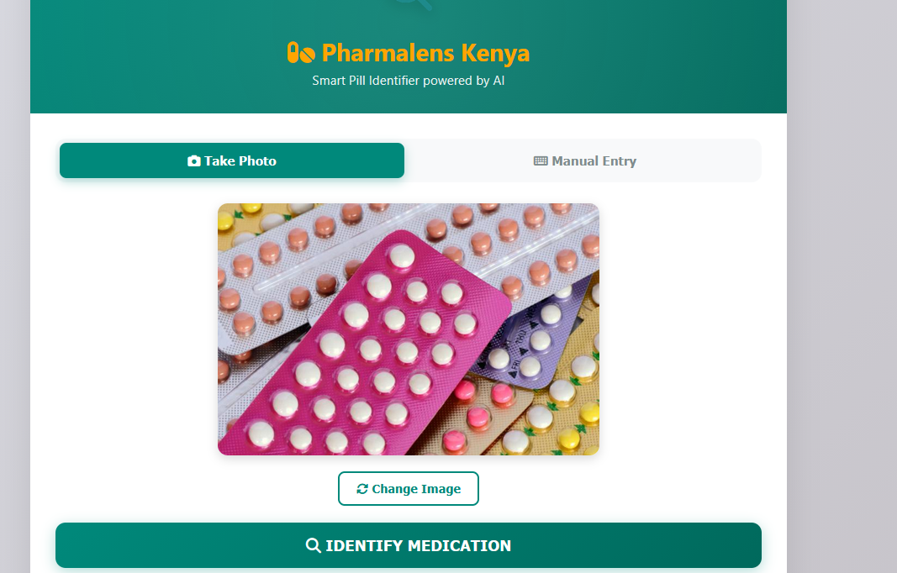
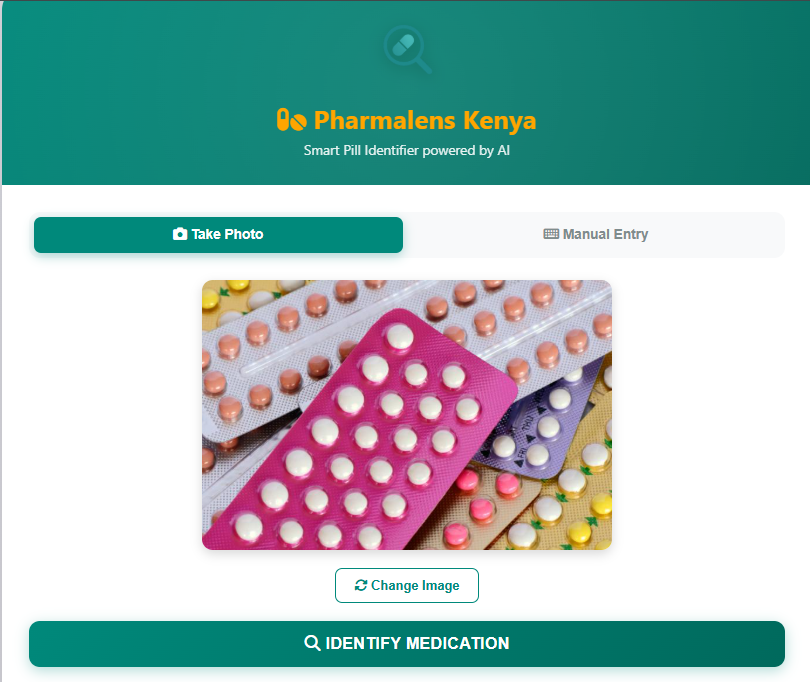
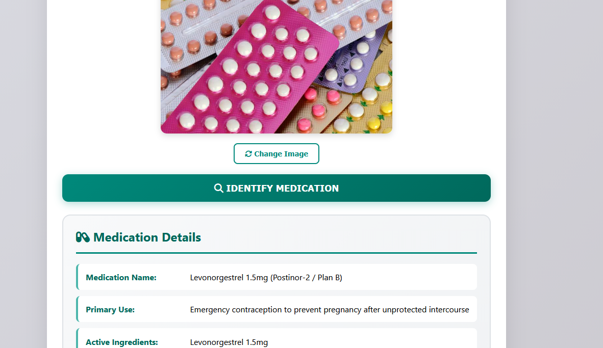
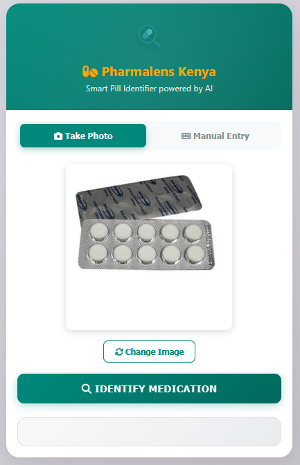
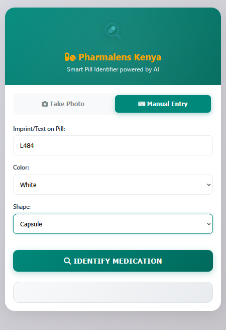

<div align="center">
  
  <h1>Pharmalens Kenya - Smart Pill Identifier</h1>
  <p>AI-Powered Medication Identification System</p>
  
  
  
  [](https://opensource.org/licenses/MIT)
  [](https://github.com/secbyteX03/pharmalensmedix/)
  [](http://makeapullrequest.com)
</div>

## 🎥 Video Demonstration

[](https://github.com/secbyteX03/pharmalensmedix/raw/main/med-id-app/assets/projectvideo.mp4)

*Click the image above to watch the demo video (or [view directly on GitHub](https://github.com/secbyteX03/pharmalensmedix/raw/main/med-id-app/assets/projectvideo.mp4))*

## 🌟 Overview

Pharmalens Kenya is an innovative AI-powered medication identification platform designed to help users quickly and accurately identify medications using either image recognition or manual search. Built with cutting-edge technology, our solution provides instant access to comprehensive medication information, enhancing medication safety and awareness in Kenya and beyond.

## ✨ Key Features

<div style="display: grid; grid-template-columns: repeat(auto-fit, minmax(300px, 1fr)); gap: 1.5rem; margin: 2rem 0;">
  <div style="background: #f8f9fa; padding: 1.5rem; border-radius: 10px; box-shadow: 0 2px 8px rgba(0,0,0,0.1);">
    <h3>📸 Image Recognition</h3>
    <p>Simply take or upload a photo of any medication, and our AI will identify it instantly.</p>
  </div>
  
  <div style="background: #f8f9fa; padding: 1.5rem; border-radius: 10px; box-shadow: 0 2px 8px rgba(0,0,0,0.1);">
    <h3>🔍 Manual Search</h3>
    <p>Search for medications using imprint, color, and shape for precise identification.</p>
  </div>
  
  <div style="background: #f8f9fa; padding: 1.5rem; border-radius: 10px; box-shadow: 0 2px 8px rgba(0,0,0,0.1);">
    <h3>📱 Responsive Design</h3>
    <p>Works seamlessly across all devices, from mobile phones to desktops.</p>
  </div>
</div>

## 📋 Project Documentation

### Project Proposal
[View the detailed project proposal](proposal.md) to learn about the vision, goals, and implementation details of Pharmalens Kenya.

### Presentation
[](https://docs.google.com/presentation/d/10yeDBLgg80KBhuZKO8YXmGkRf--Vm2it/edit?usp=sharing)
*Click the image above to view the full presentation on Google Slides*

## 🛠️ Tech Stack

<div style="display: flex; flex-wrap: wrap; gap: 1rem; margin: 1.5rem 0;">
  
  
  
  
  
  
  
  
  
</div>

### Frontend
- HTML5, CSS3, JavaScript (ES6+)
- [Vite](https://vitejs.dev/) - Fast frontend tooling
- [Font Awesome](https://fontawesome.com/) - Icons
- Responsive design for all devices

### Backend
- [Firebase Functions](https://firebase.google.com/docs/functions) (TypeScript)
- [Google Cloud Vertex AI](https://cloud.google.com/vertex-ai) - AI/ML Platform
- [Node.js](https://nodejs.org/) - JavaScript/TypeScript runtime
- [TypeScript](https://www.typescriptlang.org/) - Type-safe JavaScript

### Hosting & Services
- [Firebase Hosting](https://firebase.google.com/docs/hosting)
- [Firebase Authentication](https://firebase.google.com/docs/auth)
- [Cloud Firestore](https://firebase.google.com/docs/firestore)

## 🚀 Quick Start Guide

### Prerequisites

- [Node.js](https://nodejs.org/) (v16 or later)
- [npm](https://www.npmjs.com/) (v8 or later) or [Yarn](https://yarnpkg.com/)
- [Firebase CLI](https://firebase.google.com/docs/cli)
- [Git](https://git-scm.com/)
- A Firebase project with the following services enabled:
  - Firebase Authentication
  - Cloud Firestore
  - Cloud Functions
  - Firebase Hosting
- Google Cloud Project with Vertex AI API enabled

### Local Development Setup

1. **Clone the repository**
   ```bash
   git clone https://github.com/secbyteX03/pharmalensmedix.git
   cd pharmalensmedix/med-id-app
   ```

2. **Install dependencies**
   ```bash
   # Install root dependencies
   npm install
   
   # Install functions dependencies
   cd functions
   npm install
   cd ..
   ```

3. **Environment Setup**
   - Copy `.env.example` to `.env`
   - Update the Firebase configuration with your project details:
     ```env
     VITE_FIREBASE_API_KEY=your_api_key
     VITE_FIREBASE_AUTH_DOMAIN=your_project_id.firebaseapp.com
     VITE_FIREBASE_PROJECT_ID=your_project_id
     VITE_FIREBASE_STORAGE_BUCKET=your_project_id.appspot.com
     VITE_FIREBASE_MESSAGING_SENDER_ID=your_messaging_sender_id
     VITE_FIREBASE_APP_ID=your_app_id
     VITE_FIREBASE_MEASUREMENT_ID=your_measurement_id
     ```

4. **Google Cloud Configuration**
   - Enable the Vertex AI API in your Google Cloud Console
   - Create a service account with appropriate permissions
   - Download the service account key as `service-account-key.json` in the `functions` directory

5. **Running the Application**
   ```bash
   # Start the development server
   npm run dev
   ```
   The application will be available at `http://localhost:5173`

6. **Firebase Emulators (optional)**
   ```bash
   firebase emulators:start
   ```
   This will start the Firebase emulator suite for local testing.

## 📸 Application Screenshots

<div style="display: grid; grid-template-columns: repeat(auto-fit, minmax(300px, 1fr)); gap: 1.5rem; margin: 2rem 0;">
  <div>
    <h4>📱 Main Interface</h4>
    
  </div>
  <div>
    <h4>📷 Photo Upload</h4>
    
  </div>
  <div>
    <h4>🔍 Manual Search</h4>
    
  </div>
</div>

## 🚀 Deployment

1. **Build the application**
   ```bash
   npm run build
   ```

2. **Deploy to Firebase**
   ```bash
   # Login to Firebase (if not already logged in)
   firebase login
   
   # Initialize Firebase (if not already initialized)
   firebase init
   
   # Deploy everything
   firebase deploy
   
   # Or deploy specific services
   firebase deploy --only hosting
   firebase deploy --only functions
   ```

3. **Verify Deployment**
   - After successful deployment, you'll receive hosting URLs
   - Test all functionality in the production environment

## 📝 Project Structure

```
med-id-app/
├── assets/                 # Project assets and screenshots
│   ├── UI.PNG              # Application UI screenshot
│   ├── UI-view.PNG         # UI view screenshot
│   ├── UI_working.PNG      # Working UI state
│   ├── logo.png            # Application logo
│   ├── main_ui.PNG         # Main application interface
│   ├── manual_upload_ui.PNG  # Manual upload interface
│   ├── photo_upload_ui.PNG  # Photo upload interface
│   ├── projectvideo.mp4    # Demo video
│   └── [other image assets]
├── dist/                   # Production build output
│   └── assets/
│       ├── logo-*.png      # Compiled logo assets
│       └── main-*.js       # Compiled JavaScript
│   └── index.html          # Production index file
├── functions/              # Cloud Functions
│   ├── lib/                # Compiled JavaScript
│   │   ├── index.js        # Main functions entry
│   │   └── index.js.map    # Source maps
│   ├── node_modules/       # Dependencies
│   └── package.json        # Function dependencies
├── .gitignore             # Git ignore rules
├── firebase.json          # Firebase configuration
├── firestore.rules        # Firestore security rules
├── firestore-debug.log    # Debug logs
├── package.json           # Project dependencies
├── package-lock.json      # Dependency lock file
├── proposal.md            # Project proposal document
├── README.md              # This documentation
└── vite.config.js         # Vite configuration
```

## 🧪 Testing

```bash
# Run unit tests
npm test

# Run end-to-end tests
npm run test:e2e
```

## 📱 Usage

### Image-Based Identification
1. Click on the "Take Photo" tab
2. Upload an image of the medication
3. Click "Identify Medication"
4. View the detailed medication information

### Manual Search
1. Click on the "Manual Search" tab
2. Enter any known details about the medication (imprint, color, shape)
3. Click "Identify Medication"
4. View the matching medications

## 🛡️ Security

- All API calls are made over HTTPS
- Sensitive data is stored securely in environment variables
- Firebase Authentication secures user data
- Regular security audits are performed

## 🤝 How to Contribute

We welcome contributions from the community! Here's how you can help:

1. **Report Bugs**
   - Check existing issues to avoid duplicates
   - Provide detailed reproduction steps
   - Include screenshots or error messages

2. **Suggest Enhancements**
   - Open an issue with the "enhancement" label
   - Describe the proposed changes and benefits

3. **Submit Pull Requests**
   ```bash
   # Create a new branch
   git checkout -b feature/amazing-feature
   
   # Make your changes
   git add .
   git commit -m "Add amazing feature"
   
   # Push to the branch
   git push origin feature/amazing-feature
   
   # Open a Pull Request
   ```

4. **Code Review**
   - Ensure all tests pass
   - Follow the existing code style
   - Update documentation as needed

## 📞 Contact

- 📧 Email: [faithmagret10@gmail.com](mailto:faithmagret10@gmail.com)
- 🌐 Website: [Pharmalens Kenya](https://pharmalensmedix.web.app/)

## 🙏 Acknowledgments

- [Google Cloud](https://cloud.google.com/) for providing the Vertex AI platform
- [Firebase](https://firebase.google.com/) for the amazing backend services
- All open source contributors and the developer community

Contributions are welcome! Please follow these steps:

1. Fork the repository
2. Create a feature branch (`git checkout -b feature/AmazingFeature`)
3. Commit your changes (`git commit -m 'Add some AmazingFeature'`)
4. Push to the branch (`git push origin feature/AmazingFeature`)
5. Open a Pull Request

## 📄 License

This project is licensed under the MIT License - see the [LICENSE](LICENSE) file for details.

## 📞 Get in Touch

Have questions or feedback? We'd love to hear from you!

- 📧 Email: [faithmagret10@gmail.com](mailto:faithmagret10@gmail.com)
- 🌐 Website: [Pharmalens Kenya](https://pharmalensmedix.web.app/)
- 💬 Join our community forum

## 🙏 Acknowledgments

This project was made possible thanks to:

- **Google Cloud Platform** for the powerful infrastructure
- **Firebase** for backend services and hosting
- **Vertex AI** for advanced machine learning capabilities
- **Open Source Community** for the amazing tools and libraries

## 🌟 Show Your Support

If you find this project useful, please consider giving it a ⭐️ on [GitHub](https://github.com/secbyteX03/pharmalensmedix).

---

<div align="center">
  <p>© 2025 Pharmalens Kenya. All rights reserved.</p>
</div>
